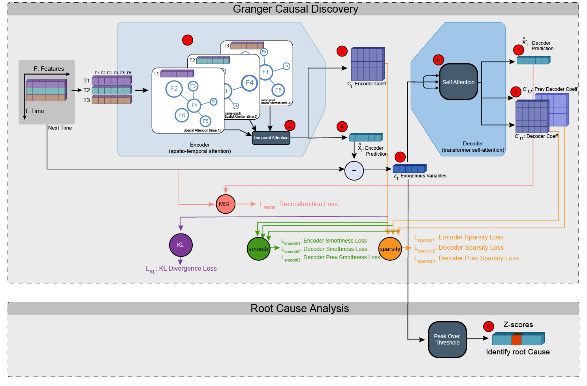

## Forked from AERCA: Root Cause Analysis of Anomalies in Multivariate Time Series through Granger Causal Discovery (ICLR 2025 Oral)

# RoGSTA: Root cause Graph Spatial Temporal Attention Network (Submitted to FSE 2026)
<div align="center">
  
</div>

---

## 🗂️ Table of Contents

1. [Overview](#overview)
2. [System Configuration](#system-configuration)
3. [Installation](#installation)
4. [Usage](#usage)
    - [Cloning the Repository](#cloning-the-repository)
    - [Running the Code](#running-the-code)
5. [Datasets](#datasets)

---

## 📘 Overview

The RoGSTA algorithm performs robust root cause analysis in multivariate time series data by leveraging Granger causal discovery methods. It includes a graph spatio-temporal attention with a self-attention decoder. It then utilizes peak-over-threshold at inference to identify the root causes.
This implementation in PyTorch facilitates experimentation on both synthetic and real-world datasets, allowing researchers to:
- Identify causality relationships among variables.
- Detect anomalies and trace them to their root causes.
- Compare performance across various types of datasets.

---

## 🧰 System Configuration

All experiments were executed on a high-performance Linux workstation with an Intel(R) Core(TM) i9-10900K CPU @ 3.70GHz (20 cores), 32 GB RAM, and an NVIDIA GeForce RTX 3070 GPU with 8 GB memory, running Ubuntu 22.04.2 LTS. The implementation leverages Python 3.10.12, PyTorch 2.7.1+cu126 with CUDA 12.6, and PyTorch Geometric 2.6.1, providing an efficient and scalable environment that highlights the method's practical applicability to real-world, large-scale RCA tasks.

---

## ⚙️ Installation

### Prerequisites

- **Python 3.11:** Ensure that Python 3.11 is installed.
- **Virtual Environment (Recommended):** It is advisable to use a virtual environment to manage dependencies.

### Steps

1. **Install `virtualenv` (if not already installed):**

   ```bash
   python3 -m pip install --user virtualenv
    ```
   
2. **Create a virtual environment:**

   ```bash
   python3 -m venv venv
   ```
3. **Activate the virtual environment:**

   ```bash
    source venv/bin/activate
    ```
4. **Install the required packages:**
    
    ```bash
    pip install -r requirements.txt
    ```
   
5. **Deactivate the virtual environment (when done):**

   ```bash
   deactivate
   ```
---

## 🚀 Usage

### To Replicate RQ1/RQ2/RQ3To Replicate RQ1/RQ2/RQ3

```bash
    ./RQ1_attnheads.sh
    ./RQ1_lr.sh
    ./RQ2_baselines.sh
    ./RQ3_windows.sh
```

---

## 📊 Datasets
The repository includes support for multiple datasets, each designed to evaluate the algorithm under different conditions:

- [MSDS](https://github.com/hanxiao0607/AERCA/tree/main/datasets/msds): A real-world dataset from the MSDS collection.
- [SWaT](https://github.com/hanxiao0607/AERCA/tree/main/datasets/swat): A dataset for anomaly detection in water treatment systems.

Ensure that the dataset you choose is formatted as expected by the code. Additional preprocessing scripts or instructions may be provided within the repository as needed.

---
